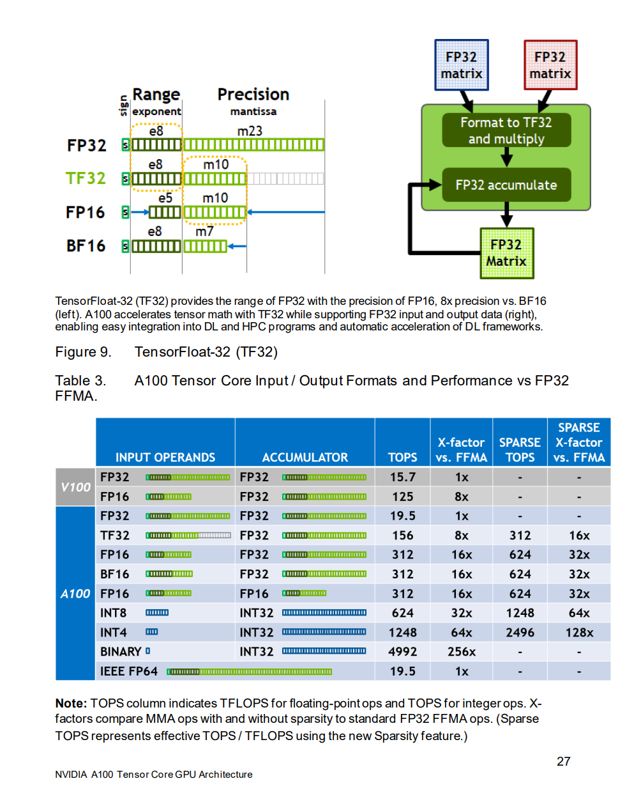

# GPT2 

This repo is inspired by **Andrej Karpathy's** YouTube video: [Let's reproduce GPT-2 (124M)](https://www.youtube.com/watch?v=l8pRSuU81PU&t=12016s). I've tried to explain to concepts related to GPT2 which I learnt through the video.

Here we are not developing the chat functionality as you seen in ChatGPT, which is done after pretraining of the models. But we can fine-tune the modeL using SFT and system-user chat dataset. Here we are developing next token predicition using GPT2 model from scrartch. Heres the example:

```
Hello, I'm a language modeler. I'm fluent in several languages. I know a lot about each one, but I don't usually write
Hello, I'm a language modeler, not a compiler and never got the time to learn this idea. I've also been working on my own
Hello, I'm a language model, but there's so little interaction that those things get out of hand at different moments, so that has to be
Hello, I'm a language model, one of the key tenets of the open source, open source computing ecosystem. I'm the founder, co-
Hello, I'm a language model. I take for granted the limitations of the English-speaking world and the vast resources of knowledge it offers. I
 ```

# Decoder only Transformer
In **Attention is all you need** paper the researcher used both encoder and decoder but for machine translation. Here we needed encoder to encode the semantics and contextual info present in English language. Decoder was given the ability to use the encoder knowlege as well as the mapping between the english and translated language to translate the language. This mapping is nothing but **Cross Attention**

## Attention
In transformer paradigm there are 3 major attention types:

- Self Attention
- Cross Attention
- Causal Attention

### Self-Attention
As the word suggests, in self-attention the words attend themesleves, like one to many mapping. Consider input set:

$$
\{x_i\}_{i=1}^{i=t} = \{x_1,\ldots,x_t\}
$$

$$
X \in \mathbb{R}^{n \times t}
$$

In the context of self-attention, the hidden state is formed by combining the input tokens $x_1, x_2\ldots,x_t$ with the corresponding attention weights $\alpha_1,\alpha_2\ldots,\alpha_t$
$$h = \alpha_1 x_1 + \alpha_2 x_2 + \cdots + \alpha_t x_t$$
In self-attention, the model computes the attention weights $\alpha_i$ based on the relationship between tokens in the sequence. This allows the model to focus on different parts of the input sequence when forming the hidden representation.

$$
a = \text{soft}(\text{arg})\max_\beta(X^\top x)
$$

But, how this $\alpha_i$ is calculated?
- For each input vector $x_i$ we calculate how similar it is to all the other input vectors. We do this by taking dot product of $x$ with each vector in the set. This gives the similarity score.
- After this, we apply softmax function to these similarity scores. This turns the score into probabilities that sum to 1. These probabilities become our attention weights. 
- Doing this for all vectors creates a set of attention weights. These sets of attention weights form the rows of our attention matrix $A$.

#### Query Keys and Value
In previous section we saw how to calculate attention score. But there were no learnable/trainable parameters involved to capture various aspects of the data, such as semantic and syntactic relationships. Lets introduce them:

$$
\displaylines{q = W_q x\\\ k=W_kx\\\ v = W_v x}
$$

In the given above equations, we can think of projecting these input vectors into higher dimesions for better representations. Each dimensions can be interpreted as some properties like: semantics, contextual features, syntatic features, etc.

Lets understand this by an example taken from [**Deep Learning notes from NYU**](https://atcold.github.io/NYU-DLSP20/en/week12/12-3/)

> For example, say we wanted to find a recipe to make lasagne. We have a recipe book and search for “lasagne” - this is the query. This query is checked against all possible keys in your dataset - in this case, this could be the titles of all the recipes in the book. We check how aligned the query is with each title to find the maximum matching score between the query and all the respective keys. If our output is the argmax function - we retrieve the single recipe with the highest score. Otherwise, if we use a soft argmax function, we would get a probability distribution and can retrieve in order from the most similar content to less and less relevant recipes matching the query.


We compare the query ***lasagne*** with all keys ***recipe titles*** to get attention scores. These scores determine how much attention to pay to each value ***recipe content***. Using softmax, we get a weighted combination of multiple recipes with weights based on how well each title matched ***lasagne***

$$
a = \text{softmax}\left(\frac{K^\top q}{\sqrt{d}}\right) \in \mathbb{R}^t
$$

The attention weights $a_1, a_2, \ldots$ represent how relevant each token is to the current query.
The attention weights $a$ are then used to compute a weighted sum of the Value (V) vectors. This step aggregates the information from the input sequence based on the relevance determined by the attention weights.
Now this output is very important for us as this contains which tokens are important given the context of input tokens. This projects the Value vectors into new representation. This new representation emphasizes the tokens that are more relvant to the query and de-emphasizes those that are less relevant. Essentially, it *projects* the value vectors into a space where the importance of each token is adjusted based on the attention scores. The resulting vector is a context-aware representation that captures the relationships and dependencies between tokens.

$$
H = VA \in \mathbb{R}^{d \times t}
$$

## Cross Attention
Now, that we understood what is self-attention, lets look at cross-attention. This mechanism is used in Machine Translation, Multimodal tasks etc. This is also known as encoder- decoder attention. Because information flows between encoder and decoder. Unlike in self-attention where we use single input sequence, in cross-attention we mix two different input sequences. The length of input sequence can differ but their dimensions must match. If two sequences are equal then it becomes self-attetion.
Query usually comes from decoder and the Keys and Values comes from encoder. 

Lets take an example to understand the differences between **Cross-Attention** and **Self-Attention**:
```
Input (English) : "The cat sits on the mat"
Output (French) : "Le chat est assis sur le tapis"
```
Now when we process *sits*
Self-Attention, will strongly attend to *cat*. It might also attend to *on* but less compared to *cat*
In the case of Cross-Attention, each word in French will attend to each word in English. For eg., when generating *assis*, cross-attention will attend *sits* strongly. Also to validate the allignment it might also attend to *cat*

- Encoder:
	- The encoder uses self-attention to process English sentences to understand its structure, context and meaning.
	- These key-value pairs are rich representations of Englishsentences capturing the relationships and dependencies between words.
- Decoder 
	- It has its own self-attention which models how french language is represented. 
	- The query vector from the decoder represents the current state of translated sentence.
	- The cross-attention focuses on the relevants parts of English sentence which are important for generating next token of French word.
	- This combination of self-attention and cross-attention helps the decoder to find the best Frech word possible which satisfies the context provided by the English sentence and correct semantic and contextual interpretation in French language. 

## Causal Attention
Causal Attention also known as Masked Self-Attention. It ensures that each token can attend to previous tokens and not future ones. This helps in preventing the model to look into the future words to maintain the causality which is essential in autoregressive models like GPT.
During the text generation any word is dependent upon its previous words and if the model is able to see the future words, during the inference the model will not have the future words which will result in mismatch between training and infrence known as exposure bias.

# Optimizations
## Hardware

| | |
|---|---|
|**Operating System**| Ubuntu 22.04.4 LTS |
| **GPU** | NVIDIA GeForce RTX 3070 Laptop GPU (8GB) |
|**Processor**|AMD Ryzen 9 5900HX with Radeon Graphics (3.30 GHz)|
|**RAM**|16GB|

For GPU specs you can find it on this spec sheet provided by NVIDIA. However, I was not able to find specfically for my GPU but here is details for RTX 3070 GPU. You can also check in this document for your own GPU: [NVIDIA AMPERE GA102](https://www.nvidia.com/content/PDF/nvidia-ampere-ga-102-gpu-architecture-whitepaper-v2.pdf#page=47&zoom=100,93,68)
The reason I mentioned this hardware spec is because now we are going to discuss some optimizations. And if your current GPU architecture design in old then some optimizations will fail.
## Using Lower Precisions
<div  align="center" onclick="https://images.nvidia.com/aem-dam/en-zz/Solutions/data-center/nvidia-ampere-architecture-whitepaper.pdf#page=27&zoom=100,93,464">

</div>

The tranformer architecture has lots of Linear layers and these layers under the hood do lots of matrix multiplications. By default these numbers are in 32-bits floating point (FP32). During matrix multiplication we can reduce this precision by half by using TF32 explicity. TF32 maintains the same numeric range as FP32 using 8 exponent bits, while reducing the mantissa precision to 10 bits (vs 23 bits in FP32). This reduced precision has been shown to be sufficient for most deep learning workloads. Inside the tensor cores of a GPU, the multiplication operation happens in TF32 but during the accumulation of all the numbers i.e., the sum of individual elements happen in FP32. This acclerates the muliplication operations by 5x which helps in reducing the training time of our model. Emprically this reduction doesn't impact so much during the training, infact it matches with FP32 accuracy, loss values, and training behavior.

We can turn this on by setting ```torch.set_float32_matmul_precision``` to ```high```. See this documentation by Pytorch: [torch.set_float32_matmul_precision](https://pytorch.org/docs/stable/generated/torch.set_float32_matmul_precision.html)

Also check out this stackoverflow answer on the differences between CUDA cores and Tensor cores. # [What is the difference between cuda vs tensor cores?](https://stackoverflow.com/questions/47335027/what-is-the-difference-between-cuda-vs-tensor-cores)

## Automatic Mix Precision Package (Pytorch)

In addition to further optimizing our training by setting the matrix multiplication precision to "high" using `torch.set_matmul_precision("high")`, we can also leverage PyTorch's Automatic Mixed Precision (AMP) package. While the `torch.set_matmul_precision("high")` function specifically targets the matrix multiplications in `nn.Linear` layers, using the `torch.autocast()` context manager from the AMP package can provide additional optimization opportunities.

This means that in addition to using TensorFloat32 (TF32) for the matrix multiplications, the AMP package may also choose to use lower precision data types, such as bfloat16, for other types of operations, like convolutions or activations.
Some operations are listed on Pytorch [here](https://pytorch.org/docs/master/amp.html#cuda-ops-that-can-autocast-to-float16:~:text=file%20an%20issue.-,CUDA%20Ops%20that%20can%20autocast%20to%20float16,-__matmul__%2C%20addbmm)
```
with  torch.autocast(device_type=device, dtype=torch.bfloat16):
	logits, loss = model(x, y)
```
## Torch.Compile

>`torch.compile` is a PyTorch function introduced in PyTorch 2.x that aims to solve the problem of accurate graph capturing in PyTorch and ultimately enable software engineers to run their PyTorch programs faster. `torch.compile` is written in Python and it marks the transition of PyTorch from C++ to Python.
-- <cite>Pytorch Team</cite>

Let me explain what happens when you wrap your model with `torch.complie`
 1.  **Converts your model to a computation graph**: PyTorch converts your model's operations into a graph representation, similar to how frameworks like TensorFlow and JAX work.
2.  **Applies graph optimizations**: PyTorch then applies various graph optimizations to the computation graph, such as:
    
    -   **Operator fusion**: Fusing multiple operators into a single optimized kernel to reduce memory access and improve performance.
    -   **Constant folding**: Precomputing values that don't depend on the input data.
    -   **Memory layout optimization**: Optimizing the memory layout of tensors to improve cache utilization and reduce memory access.
    
3.  **Compiles the optimized graph**: Finally, PyTorch compiles the optimized computation graph into efficient machine code that can be executed on the target hardware (e.g., CPU or GPU).

I would suggest to go over this blog post by *Eduardo Alvarez* on [**PyTorch 2.0 Takes a Leap Forward in Performance and Innovation**](https://eduand-alvarez.medium.com/pytorch-2-0-takes-a-leap-forward-in-performance-and-innovation-3f7fcc5b2e7a)

Our code:
```
# create model
model = GPT(GPTConfig(vocab_size=50304))
model.to(device)
model = torch.compile(model)
```

# ...